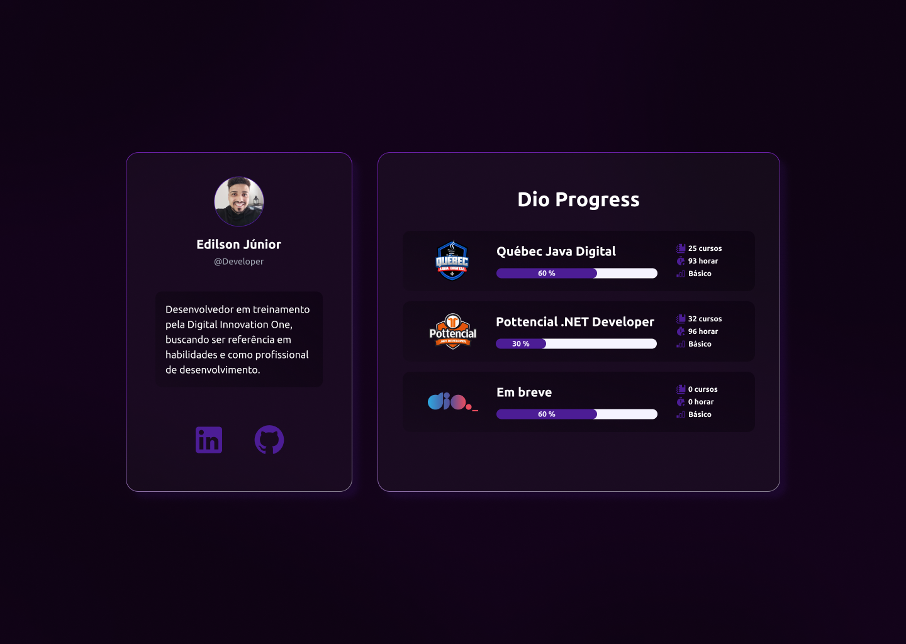

# Dio Progress

Projeto para completar o desafio da Digital Innovation One - "Criando seu Primeiro Repositório no GitHub Para Compartilhar Seu Progresso".

## 🚀 Detalhes

Foi desenvolvido uma página web que simula o demostrativo do perfil do aluno, com uma breve aprensentação e seu progresso na execução do curso. Detalhes apenas simulados.

[Digital Innovation One](https://web.dio.me/) - Site odicial

## 🎇 Layout

  

  [DioProgress](https://www.figma.com/file/pcl8qDMwkuBQaJ6bHv9sak/DioProgress?node-id=0%3A1&t=vp7tmVSRRkD7GtRG-0) - Layout oficial

## 🛠️ Construção

 

 

* [Figma](https://www.figma.com/) - Criação do design
* [Vite](https://vitejs.dev/) - Gerencia de criação do projeto
* [Tailwind](https://tailwindcss.com/) - Ferramenta de estilização
* [Mui UI](https://mui.com/) - Biblioteca de componentes
* [Material design Icons](https://materialdesignicons.com/) - Biblioteca de icons

---
⌨️ Por [Edilson Júnior](https://github.com/edilsonfj) 